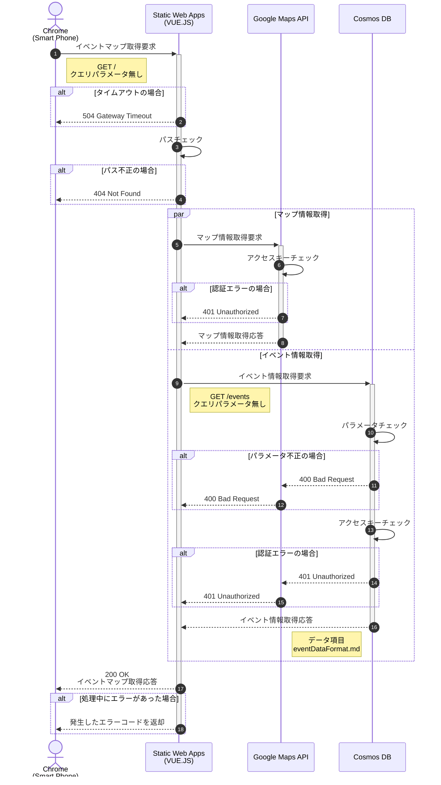

# 処理フロー：マップ表示

## 凡例
- 実線： リクエスト を表します。
- 破線： レスポンス を表します。
- par： 並列処理 を表します。
- alt： 分岐処理 を表します。(主に例外処理として利用)

----

```mermaid
sequenceDiagram
  autonumber
  actor browser as Chrome<br/>(Smart Phone)
  participant swa as Static Web Apps<br/>(VUE.JS)
  participant mapapi as Google Maps API
  participant cdb as Cosmos DB

  browser ->>+ swa: イベントマップ取得要求
  Note right of browser: GET /<br>クエリパラメータ無し
  alt タイムアウトの場合
    swa -->> browser: 504 Gateway Timeout
  end
  swa ->> swa: パスチェック
  alt パス不正の場合
    swa -->> browser: 404 Not Found
  end

  par マップ情報取得
    swa->>+mapapi: マップ情報取得要求
    mapapi->>mapapi: アクセスキーチェック
    alt 認証エラーの場合
      mapapi -->> swa: 401 Unauthorized
    end
    mapapi-->>-swa: マップ情報取得応答

  and イベント情報取得
    swa ->>+ cdb: イベント情報取得要求
    Note right of swa: GET /events<br>クエリパラメータ無し
    cdb ->> cdb: パラメータチェック
    alt パラメータ不正の場合
      cdb -->> mapapi: 400 Bad Request
      mapapi -->> swa: 400 Bad Request
    end

    cdb->>cdb: アクセスキーチェック
    alt 認証エラーの場合
      cdb -->> mapapi: 401 Unauthorized
      mapapi -->> swa: 401 Unauthorized
    end

    cdb -->>- swa: イベント情報取得応答
    Note left of cdb: データ項目<br>eventDataFormat.md
  end

  swa -->> browser: 200 OK<br>イベントマップ取得応答
  alt 処理中にエラーがあった場合
    swa -->>- browser: 発生したエラーコードを返却
  end
```